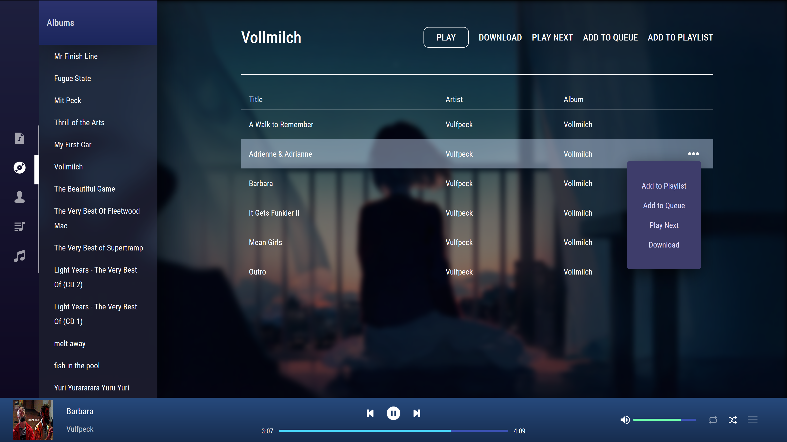

## music_player

In browser music player for local files.

- parse.js parses all the music files in `client/public/music/` and stores the data in music_saves.json as well as gets the covers and stores them in `client/public/covers/`
- the player has features such as playlists, shuffle, loop, the basics of a music player etc.
- put background images in `client/public/background` and it'll load a random one each time

My motives behind this project were to get a sense of how react/ redux work and to just have a player that I designed myself. Maybe some day I will port it to electron but who knows. ¯\\_(ツ)_/¯